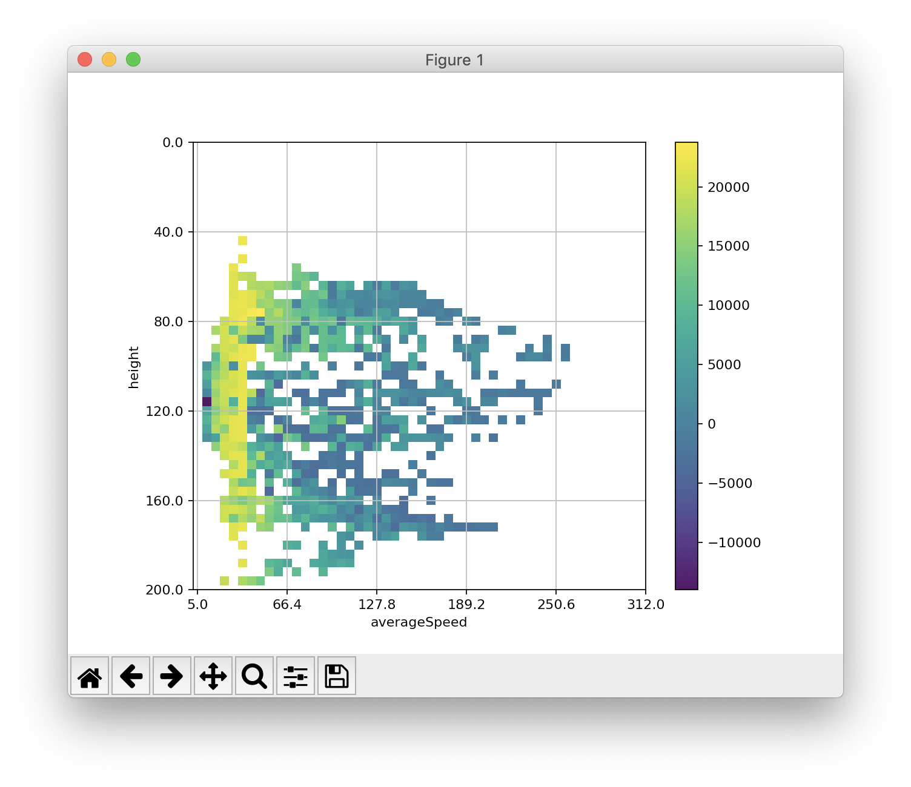

# Illuminating Game Space Using MAP-Elites for Assisting Video Game Design


The CaveSwing implementation is taken from this [repository](https://github.com/ljialin/SimpleAsteroids.)

A more detailed setup tutorial can be found in this [link](https://docs.google.com/document/d/11vbF9zJkiSTIe_DpsB4NC_yih7Ls5nldk8YQ0aTJ18c/edit).

## Installation
Python dependencies (It is recommended to create a virtual environment for the project):
- thrift
- numpy
- matplotlib
- tqdm

You can install the dependencies by running ```pip install -r requirements.txt```

optionally: Jupiter notebook, but the interactive visualisation does not work in the notebook.

Java
- version 8+ (with language level 8)
- additional libraries are in the lib subfolder (gson and thrift are required to run the example)

## Running Map-elites
The main files for tuning the parameters in CaveSwing can be found in the src/hyperopt package. It contains both python and Java code.

To run the project the follow these steps:
- 1, run main in ```TuneMapElites.java```, which starts up the server.
- 2, run ```mapElite.py``` with python

You can modify, which behaviour descriptors you want to use.
It is also possible to add new descriptors, which has to be done on the Java side in the ```TuneMapElites.java```, where the descriptors are added to the ```Results``` object.

## Initialize MAP-elites

Define the threshold for the bins, which should be the minimum and maximum values of the expected behaviour characterization values.
```python
mapElite.behaviour_tresholds = [
    ("height", (mapElite.get_threshold(min=0, max=200, bins=50))),
    ("averageSpeed", (mapElite.get_threshold(min=5., max=312., bins=50)))]
```

Connect to the Java client (should run ```TuneMapElites.java``` first) and run the ```numIters``` of iterations with G random initial solutions. After running G random parameters the remaining iterations mutates the found parameters to find new ones.
```python
client = mapElite.connectToServer()
elites = mapElite.runSimulation(numIters, randomSolutions, client)
```

Visualize the found solutions as a heatmap. 
```python
mapElite.makeHeatMap(elites)
```
After running for 2000 iterations, we should get a heatmap similar to this. For running longer more bins should be filled up by the algorithms.


## Modifying Behavioral Characterization
Got to ```TuneMapElites.java``` and you can define new ways to collect data in the PlayGame function, you just have to make sure to add it a new name and put it into the Results map.
Existing Behavioural Characterizations are:
- ```height```; average height the agent takes during evaluation
- ```averageSpeed```; average speed to complete the level
- ```ticks```; average number of ticks the agent takes to finish the level
- ```ropeActions```; average number of rope actions used during evaluation
- ```anchorNormalized```; calculated as: ```ropeActions / numAnchors / nTicks``` and averaged over N evaluations.

Then to use the new Behavioural Characterization on the python side, you just have to use the new name in MAP-elites initialization.
```python
mapElite.behaviour_tresholds = [
    ("<bc1>", (mapElite.get_threshold(min1, max1, bins1))),
    ("<bc2>", (mapElite.get_threshold(min2, max2, bins2)))]
```
where <bc1> and <bc2> are the names of the behavioral characterizations and ```min```, ```max``` are the ranges for the values it might take (or the area we are interested in) and ```bins``` define the number of grids used within these ranges.

Please cite this paper if you use this in your work:
```
@article{balla2021illuminating,
  title={Illuminating Game Space Using MAP-Elites for Assisting Video Game Design},
  author={Balla, Martin and Barahona-R{\i}os, Adri{\'a}n and Katona, Adam and P{\'e}rez, Nuria Pena and Spick, Ryan},
  year={2021},
  booktitle={11th AISB Symposium on AI & Games}
}
```

